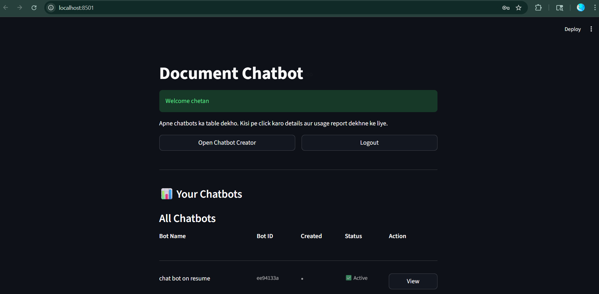
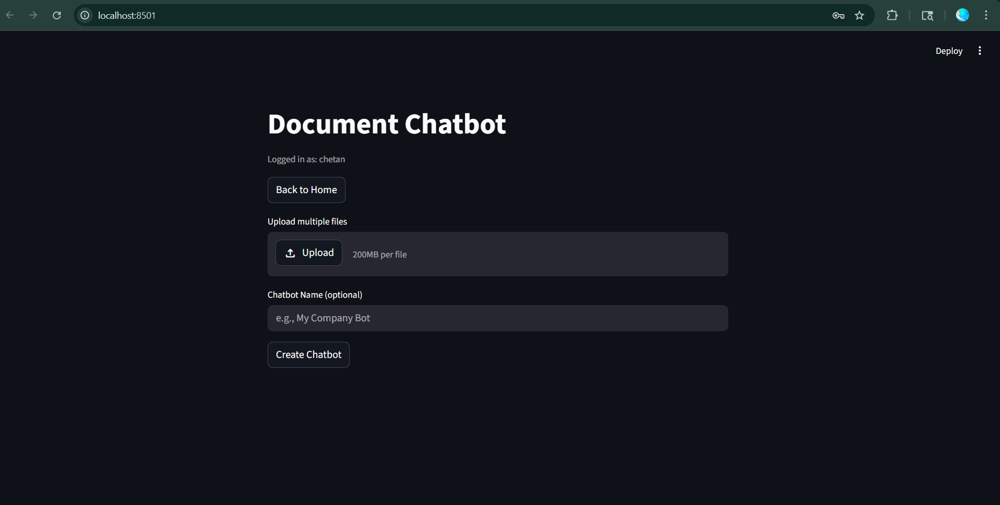
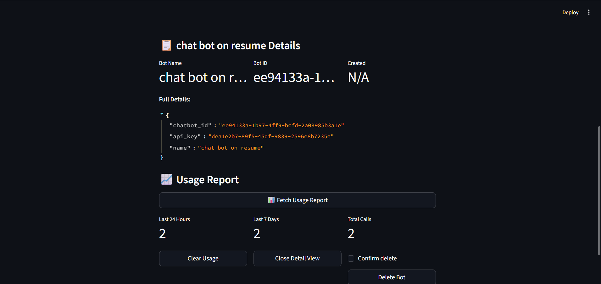

# Create Your Own Chatbot

A document-aware chatbot platform that lets you upload files, build a private chatbot, and query it through a clean Streamlit UI backed by FastAPI, FAISS, and Ollama.

## Highlights

- Upload PDF and DOCX files to build a chatbot from your own documents.
- Store each chatbot in its own FAISS vector index for clean ownership separation.
- Log in, create chatbots, and view usage metrics from a single dashboard.
- Keep configuration local with `.env` instead of hardcoding environment-specific values.
- Test and manage bot usage without exposing runtime data in Git.

## Tech Stack

- FastAPI
- Streamlit
- FAISS
- Hugging Face sentence-transformers
- Ollama with Mistral
- Python-dotenv

## Preview

| Home | Creator | Details |
| --- | --- | --- |
|  |  |  |

Demo video: [Watch the walkthrough](assets/demo/demo.mp4)

## Project Layout

```text
backend/
  app.py
frontend/
  main.py
  auth_page.py
  chatbot_page.py
  home_page.py
  state.py
assets/
  screenshots/
  demo/
db/
  users/
  users.json
  usage.json
```

`db/` is runtime data and is created locally. It is ignored by Git so user accounts, usage logs, and generated FAISS indexes stay private.

## Setup

### 1. Create a virtual environment

```powershell
python -m venv venv
& ".\\venv\\Scripts\\Activate.ps1"
```

### 2. Install dependencies

```powershell
pip install -r requirements.txt
```

### 3. Configure environment variables

```powershell
Copy-Item .env.example .env
```

Edit `.env` if you want to change the backend URL or Ollama settings.

### 4. Start Ollama

```powershell
ollama run mistral
```

## Run Locally

Open two terminals in the project root.

### Backend

```powershell
& ".\\venv\\Scripts\\Activate.ps1"
uvicorn backend.app:app --reload
```

### Frontend

```powershell
& ".\\venv\\Scripts\\Activate.ps1"
streamlit run frontend\\main.py
```

## Environment Variables

| Variable | Purpose | Default |
| --- | --- | --- |
| `BACKEND_URL` | Base URL used by the Streamlit frontend | `http://127.0.0.1:8000` |
| `OLLAMA_URL` | Ollama generation endpoint | `http://localhost:11434/api/generate` |
| `OLLAMA_TIMEOUT` | Timeout in seconds for LLM requests | `180` |
| `MAX_CONTEXT_CHARS` | Maximum context sent to the model | `3000` |
| `MAX_FALLBACK_CONTEXT_CHARS` | Smaller fallback context size | `1200` |

## API Endpoints

- `POST /api/register-user`
- `POST /api/login-user`
- `POST /api/register-chatbot`
- `POST /api/chat`
- `POST /api/usage-report`
- `DELETE /api/usage-clear`
- `DELETE /api/delete-chatbot`

## Live Demo

Not deployed yet.

## Notes

- The API key shown in the UI is meant to be treated as secret for each chatbot owner.
- The `api check/` folder is development-only and ignored from Git.
- The `assist/` folder contains local demo exports and is ignored from Git after being copied into `assets/`.
- If a response feels slow, keep Ollama warm and try a shorter question.

## License

MIT
